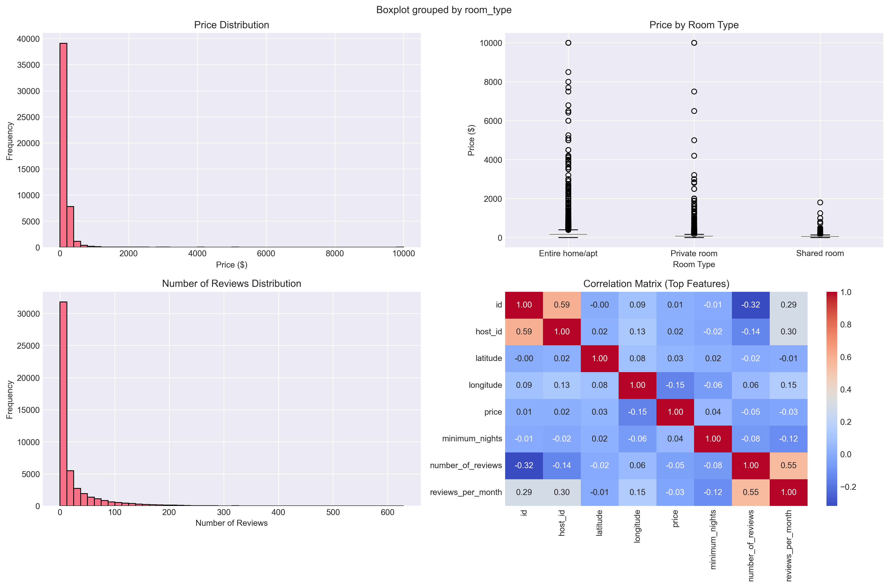
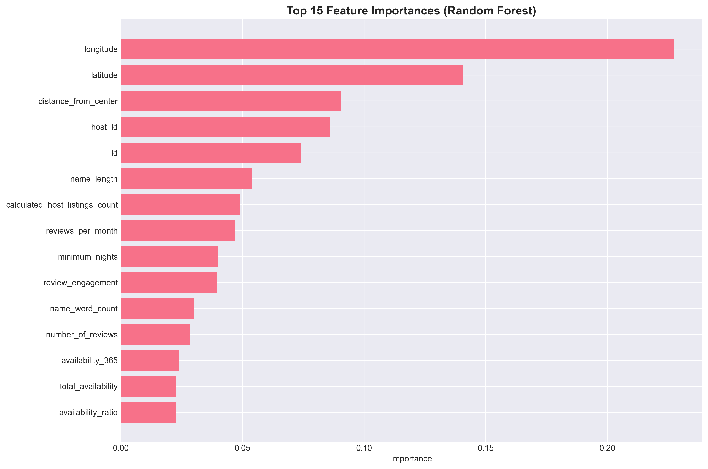
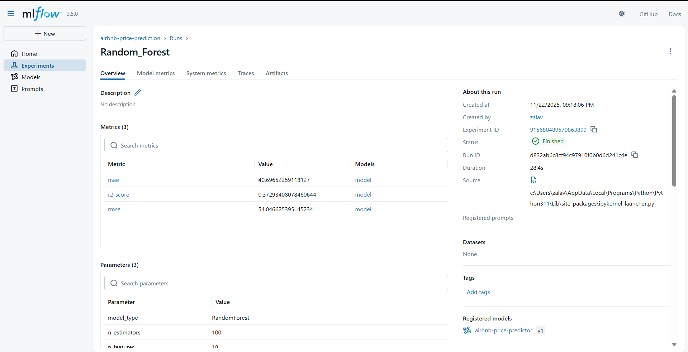

# 🏠 Predicting Airbnb Listing Prices with MLflow & AWS S3

Welcome to the **StayWise Airbnb Price Prediction** project!  
This repository implements a full machine learning pipeline—from data ingestion with AWS S3 to experiment tracking with MLflow—to help automatically predict optimal nightly prices for Airbnb listings.

---

## 🚀 Project Overview

- **Goal:** Predict the nightly price of an Airbnb listing using data such as location, amenities, reviews, and host details.
- **Tech Stack:** Python, pandas, scikit-learn, XGBoost, MLflow, AWS S3, Jupyter Notebook.
- **Track your experiments:** All model runs and metrics are logged using MLflow for transparent, reproducible modeling.

---

## 📁 Repository Structure

 * [src](./src)
   * [Air_preprocessing.py](./src/Air_preprocessing.py)
   * [data_loader.py](./src/data_loader.py)
   * [Future_engineering.py](./src/Future_engineering.py)
   * [Ml_flow.py](./src/Ml_flow.py)
   * [train.py](./src/train.py)
 * [plot](./plot)
 * [main.ipynb](./main.ipynb)
 * [README.md](./README.md)
 * [mlruns](./mlruns)
 * [requirements.txt](./requirements.txt)
---

## 🛠️ Quickstart

1. **Clone the repo and install requirements:**
    ```
    git clone https://github.com/yourusername/airbnb-price-prediction.git
    cd airbnb-price-prediction
    pip install -r requirements.txt
    ```

2. **Set up AWS credentials:**  
   - Add your credentials to a `.env` file in the project root:
     ```
     AWS_ACCESS_KEY_ID=your_access_key
     AWS_SECRET_ACCESS_KEY=your_secret_key
     REGION_NAME=us-east-2
     ```

3. **Run the main notebook:**
   - Open `notebooks/airbnb_pipeline.ipynb` in Jupyter or VSCode
   - Cell-by-cell execution walks you through data loading, EDA, preprocessing, feature engineering, and model training—with MLflow logging!

4. **(Optional, for MLflow UI on your machine):**
    ```
    pip install mlflow
    mlflow ui --port 5000
    ```
   - Visit [http://localhost:5000](http://localhost:5000) in your browser.

---

## 📊 Sample EDA Visualization




---

## 🌟 MLflow Experiment Snapshots

**A. MLflow Home with Experiments**


**B. MLflow Experiment Run Table**


**C. MLflow Run Detail – Random Forest Model**



---


## 💡 Key Features

- **Automated AWS S3 data ingestion** via a custom loader.
- **Robust data preprocessing:** missing value imputation, outlier cleaning (IQR/z-score), categorical encoding.
- **Powerful feature engineering:** text, review, location, host, and amenity-based features.
- **Modeling:** Linear Regression, Ridge, Random Forest, Gradient Boosting, XGBoost.
- **Experiment tracking** with MLflow—log every metric, parameter, and artifact.
- **Best model registration** for future deployment and reproducibility.

---

## 📝 Notebooks & Scripts

- **notebooks/airbnb_pipeline.ipynb**  
  The full pipeline: S3 → Preprocessing → Feature Engineering → ML models → MLflow.
- **src/data_loader.py**  
  Utility for S3 data reading/writing.
- **src/preprocessing.py**  
  Preprocessing utilities for Airbnb features.
- **src/feature_engineering.py**  
  All-in-one feature extraction for ML.
- **src/model_training.py**  
  Model training and MLflow integration.

---

## 📎 Requirements

See [`requirements.txt`](requirements.txt) for the full list of Python packages.

---

## 🙌 Credits

- **Dataset:** Airbnb Open Data
- **Team:** StayWise Data Science Team

---

## 📬 Questions & Contact

For any issues, file [an issue on GitHub](https://github.com/Jenishbhai-dev/airbnb-price-prediction/issues).

---

> *“Good models are built on good data and great documentation.”*

---

