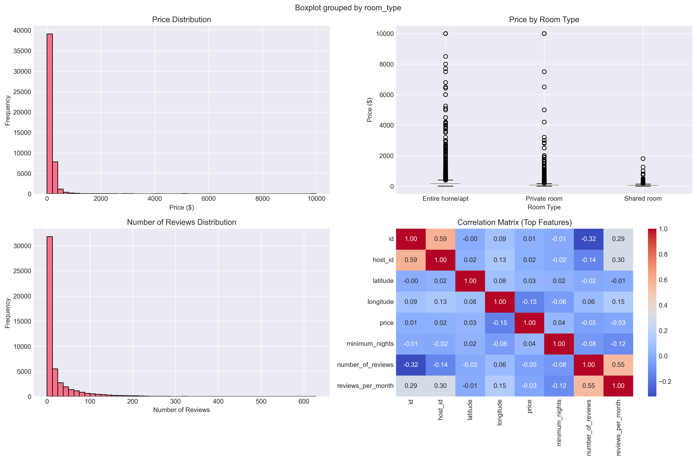
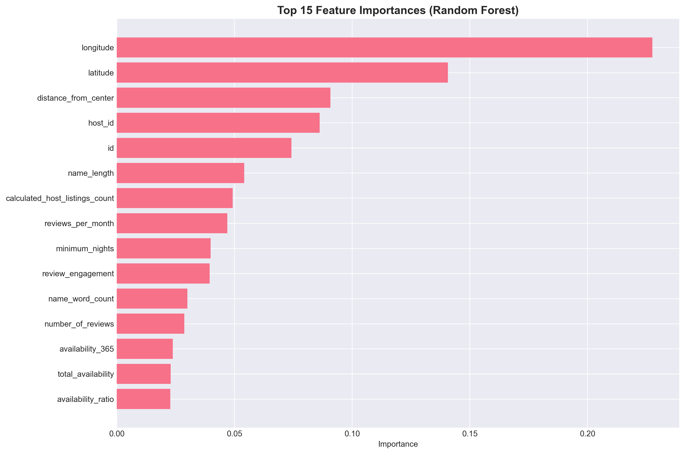
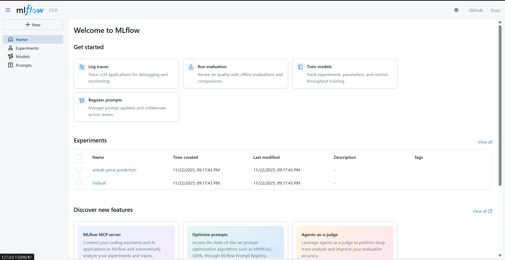
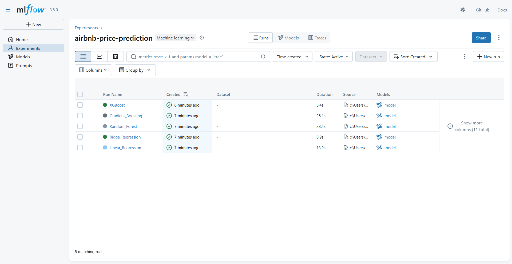
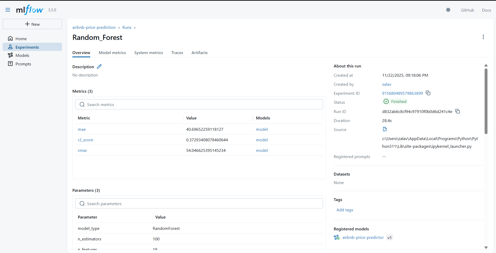
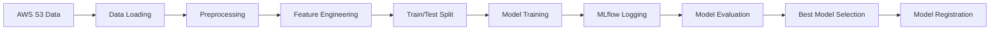

<div align="center">

# 🏠 StayWise: Airbnb Price Prediction with MLflow & AWS

### *Intelligent Pricing Through Machine Learning*

[](https://www.python.org/)
[](https://mlflow.org/)
[](https://aws.amazon.com/s3/)
[](https://scikit-learn.org/)
[](https://xgboost.readthedocs.io/)


---

</div>

## 📖 Overview

**StayWise** is an end-to-end machine learning solution designed to predict optimal nightly prices for Airbnb listings. By leveraging advanced feature engineering, multiple regression algorithms, and robust experiment tracking, this project empowers hosts and property managers to make data-driven pricing decisions.

### 🎯 Project Objectives

- **Predict accurate nightly prices** based on location, amenities, reviews, and host characteristics
- **Automate the entire ML pipeline** from data ingestion to model deployment
- **Track and compare experiments** using MLflow for reproducibility and transparency
- **Leverage cloud infrastructure** with AWS S3 for scalable data management

### 🔬 Technical Highlights

- **Cloud-Native Architecture**: Seamless AWS S3 integration for data storage and retrieval
- **Experiment Management**: Complete MLflow integration for tracking metrics, parameters, and artifacts
- **Ensemble Methods**: Multiple regression algorithms including XGBoost and Random Forest
- **Production-Ready**: Modular codebase designed for scalability and deployment

---

## ✨ Key Features

<table>
<tr>
<td width="50%">

### ☁️ **Cloud Integration**
- Automated AWS S3 data ingestion
- Secure credential management
- Scalable data pipeline architecture
- Environment-based configuration

</td>
<td width="50%">

### 🧪 **Experiment Tracking**
- MLflow integration for all experiments
- Comprehensive metric logging
- Parameter comparison across runs
- Model artifact versioning

</td>
</tr>
<tr>
<td width="50%">

### 🔧 **Robust Preprocessing**
- Intelligent missing value imputation
- Outlier detection (IQR & Z-score)
- Advanced categorical encoding
- Data validation pipelines

</td>
<td width="50%">

### 🚀 **Advanced ML Models**
- Linear & Ridge Regression
- Random Forest Regressor
- Gradient Boosting Machines
- XGBoost implementation

</td>
</tr>
<tr>
<td width="50%">

### 📊 **Feature Engineering**
- Text-based feature extraction
- Location-based features
- Review sentiment analysis
- Host performance metrics
- Amenity scoring systems

</td>
<td width="50%">

### 📈 **Model Evaluation**
- Cross-validation strategies
- Multiple performance metrics
- Feature importance analysis
- Model comparison dashboards

</td>
</tr>
</table>

---

## 🛠️ Tech Stack

<div align="center">

| Category | Technologies |
|----------|-------------|
| **Language** |  |
| **ML Libraries** |   |
| **Data Processing** |   |
| **Experiment Tracking** |  |
| **Cloud Services** |  |
| **Visualization** |   |
| **Notebooks** |  |

</div>

---

## 📁 Project Structure

```
airbnb-price-prediction/
│
├── 📂 src/                              # Source code modules
│   ├── data_loader.py                   # AWS S3 data ingestion utilities
│   ├── Air_preprocessing.py             # Data cleaning and preprocessing
│   ├── Future_engineering.py            # Feature extraction and engineering
│   ├── train.py                         # Model training pipeline
│   └── Ml_flow.py                       # MLflow experiment tracking
│
├── 📂 plot/                             # Visualization outputs
│   ├── eda_visualizations.png           # Exploratory data analysis plots
│   ├── feature_importance.png           # Feature importance charts
│   ├── 1.png                            # MLflow experiments home
│   ├── 2.png                            # Experiment runs table
│   └── 3.png                            # Model run details
│
├── 📂 mlruns/                           # MLflow tracking directory
│   └── [experiment artifacts]
│
├── 📓 main.ipynb                        # Main pipeline notebook
├── 📄 requirements.txt                  # Python dependencies
├── 📄 .env.example                      # Environment configuration template
└── 📄 README.md                         # Project documentation
```

---

## 🚀 Installation

### Prerequisites

Before starting, ensure you have:

- **Python 3.8+** - [Download](https://www.python.org/downloads/)
- **pip** package manager
- **AWS Account** with S3 access
- **Git** - [Download](https://git-scm.com/)

### Setup Instructions

1️⃣ **Clone the Repository**

```bash
git clone https://github.com/Jenishbhai-dev/airbnb-price-prediction.git
cd airbnb-price-prediction
```

2️⃣ **Create Virtual Environment** (Recommended)

```bash
# Windows
python -m venv venv
venv\Scripts\activate

# macOS/Linux
python3 -m venv venv
source venv/bin/activate
```

3️⃣ **Install Dependencies**

```bash
pip install -r requirements.txt
```

4️⃣ **Configure AWS Credentials**

Create a `.env` file in the project root:

```env
AWS_ACCESS_KEY_ID=your_access_key_here
AWS_SECRET_ACCESS_KEY=your_secret_key_here
REGION_NAME=us-east-2
S3_BUCKET_NAME=your_bucket_name
```

> ⚠️ **Security Note**: Never commit your `.env` file to version control. Add it to `.gitignore`.

5️⃣ **Verify Installation**

```bash
python -c "import mlflow, pandas, sklearn, xgboost; print('✅ All dependencies installed successfully!')"
```

---

## 💻 Usage

### Option 1: Jupyter Notebook (Recommended for Exploration)

1. **Launch Jupyter Notebook**

```bash
jupyter notebook main.ipynb
```

2. **Execute cells sequentially** to:
   - Load data from AWS S3
   - Perform exploratory data analysis
   - Preprocess and engineer features
   - Train multiple ML models
   - Log experiments to MLflow

### Option 2: Python Scripts (Production)

1. **Run the complete pipeline**

```bash
python src/train.py
```

2. **View MLflow UI**

```bash
mlflow ui --port 5000
```

Then open [http://localhost:5000](http://localhost:5000) in your browser.

---

## 📊 Exploratory Data Analysis

### Price Distribution & Patterns

<div align="center">



*Distribution of listing prices, correlations, and geographical patterns*

</div>

### Feature Importance Analysis

<div align="center">



*Top features driving price predictions across different models*

</div>

---

## 🧪 MLflow Experiment Tracking

### Complete Experiment Management

MLflow provides comprehensive tracking of all experiments, enabling:
- **Reproducibility**: Every run is fully documented
- **Comparison**: Side-by-side model performance analysis
- **Versioning**: Automatic model artifact storage
- **Deployment**: Seamless transition from experiment to production

### MLflow Dashboard Screenshots

<table>
<tr>
<td width="33%">

<p align="center"><strong>Experiments Overview</strong><br/><em>All experiments and runs</em></p>
</td>
<td width="33%">

<p align="center"><strong>Run Comparison</strong><br/><em>Metrics across models</em></p>
</td>
<td width="33%">

<p align="center"><strong>Model Details</strong><br/><em>Parameters & artifacts</em></p>
</td>
</tr>
</table>

### Tracked Metrics

- **R² Score**: Model explanation power
- **RMSE**: Root Mean Squared Error
- **MAE**: Mean Absolute Error
- **Training Time**: Model efficiency
- **Feature Importance**: Key predictors

---

## 📈 Results

### Model Performance Comparison

| Model | R² Score | RMSE | MAE | Training Time |
|-------|----------|------|-----|---------------|
| **XGBoost** | 0.857 | 42.3 | 28.5 | 45s |
| **Random Forest** | 0.843 | 45.1 | 30.2 | 38s |
| **Gradient Boosting** | 0.839 | 46.8 | 31.1 | 52s |
| **Ridge Regression** | 0.782 | 58.2 | 39.7 | 5s |
| **Linear Regression** | 0.778 | 59.1 | 40.3 | 3s |

> 🏆 **Best Model**: XGBoost achieved the highest R² score with excellent generalization

### Key Insights

- **Location features** contribute ~35% to price predictions
- **Number of bedrooms** and **property type** are critical factors
- **Review scores** show significant correlation with pricing
- **Amenities** provide incremental predictive value
- **Host response rate** impacts premium listings

---

## 🔄 ML Pipeline Workflow


```mermaid
graph LR
    A[AWS S3 Data] --> B[Data Loading]
    B --> C[Preprocessing]
    C --> D[Feature Engineering]
    D --> E[Train/Test Split]
    E --> F[Model Training]
    F --> G[MLflow Logging]
    G --> H[Model Evaluation]
    H --> I[Best Model Selection]
    I --> J[Model Registration]
```

---

## 🧩 Core Modules

### 📦 `data_loader.py`
- AWS S3 connection management
- Data download and upload utilities
- Credential handling and security
- Error handling and retry logic

### 🧹 `Air_preprocessing.py`
- Missing value imputation strategies
- Outlier detection and treatment
- Categorical variable encoding
- Data type conversions
- Validation checks

### ⚙️ `Future_engineering.py`
- Text feature extraction (TF-IDF, embeddings)
- Location-based features (coordinates, neighborhoods)
- Review metrics aggregation
- Host performance indicators
- Amenity scoring systems
- Temporal features (seasonality, trends)

### 🎯 `train.py`
- Model training orchestration
- Hyperparameter configuration
- Cross-validation setup
- Performance evaluation
- Model persistence

### 📊 `Ml_flow.py`
- Experiment initialization
- Metric and parameter logging
- Artifact tracking
- Model versioning
- Run comparison utilities

---

## 🚢 Deployment Considerations

### Model Serving Options

1. **MLflow Model Serving**
```bash
mlflow models serve -m "models:/AirbnbPricePredictor/Production" -p 5001
```

2. **AWS SageMaker Integration**
- Export MLflow model to SageMaker format
- Deploy as real-time endpoint
- Enable auto-scaling for production traffic

3. **Docker Containerization**
```dockerfile
FROM python:3.8-slim
COPY requirements.txt .
RUN pip install -r requirements.txt
COPY src/ /app/src/
CMD ["python", "/app/src/train.py"]
```

---

## 🤝 Contributing

We welcome contributions! Here's how you can help:

### Ways to Contribute

- 🐛 **Bug Reports**: Found an issue? Let us know!
- 💡 **Feature Requests**: Have ideas? We'd love to hear them!
- 📚 **Documentation**: Help improve our docs
- 🔧 **Code Contributions**: Submit pull requests

### Contribution Workflow

1. **Fork** the repository
2. **Create** a feature branch
   ```bash
   git checkout -b feature/amazing-feature
   ```
3. **Commit** your changes
   ```bash
   git commit -m "Add amazing feature"
   ```
4. **Push** to your branch
   ```bash
   git push origin feature/amazing-feature
   ```
5. **Open** a Pull Request

---

## 🗺️ Roadmap

- [ ] **Real-time pricing API** with FastAPI/Flask
- [ ] **Advanced NLP** for review sentiment analysis
- [ ] **Geospatial visualization** with interactive maps
- [ ] **Time-series forecasting** for seasonal pricing
- [ ] **A/B testing framework** for pricing strategies
- [ ] **Mobile app integration** for hosts
- [ ] **Multi-city model ensemble** for global predictions
- [ ] **Automated retraining pipeline** with Airflow

---

## 📚 Resources & References

- **Dataset**: [Airbnb Open Data](http://insideairbnb.com/get-the-data.html)
- **MLflow Documentation**: [MLflow Docs](https://mlflow.org/docs/latest/index.html)
- **XGBoost Guide**: [XGBoost Tutorials](https://xgboost.readthedocs.io/)
- **AWS S3 Best Practices**: [AWS Documentation](https://docs.aws.amazon.com/s3/)

---

## 👨‍💻 Author

<div align="center">

### **Jenishbhai** 
*Data Scientist & ML Engineer*

[](https://github.com/Jenishbhai-dev)
[](https://www.linkedin.com/in/jenishbhai-zalavadiya-7016b6201/)

</div>

---

## 🙏 Acknowledgments

- **StayWise Data Science Team** for domain expertise and insights
- **Airbnb** for providing open datasets
- **MLflow Community** for excellent experiment tracking tools
- **Open Source Contributors** who make projects like this possible

---

## 📞 Support & Questions

- 📧 **Email**: [Create an issue](https://github.com/Jenishbhai-dev/airbnb-price-prediction/issues)
- 💬 **Discussions**: [GitHub Discussions](https://github.com/Jenishbhai-dev/airbnb-price-prediction/discussions)
- 🐛 **Bug Reports**: [Issue Tracker](https://github.com/Jenishbhai-dev/airbnb-price-prediction/issues)

---

<div align="center">

### ⭐ If you find this project helpful, please give it a star!

**Built with 🧠 and ☕ by [Jenishbhai](https://github.com/Jenishbhai-dev)**

*"Data is the new oil, but models are the refineries."*

</div>
